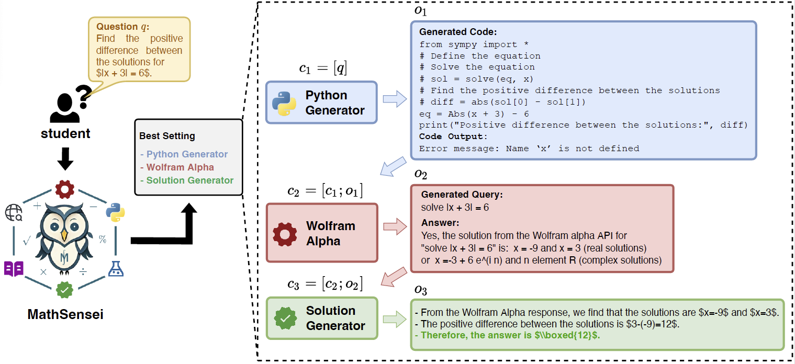

# [MathSensei: A tool-augmented LLM for Math Reasoning](https://arxiv.org/abs/2402.17231)

## An End-to-End Overview of MathSensei


### Please refer to the [official code repo](https://github.com/rakutentech/MathSensei) for codes and data used in our paper entitled ["MathSensei: A Tool-Augmented Large Language Model for Math Reasoning"](https://arxiv.org/abs/2402.17231).

## Citation 

```
@article{das2024mathsensei,
      title={MATHSENSEI: A Tool-Augmented Large Language Model for Mathematical Reasoning}, 
      author={Debrup Das and Debopriyo Banerjee and Somak Aditya and Ashish Kulkarni},
      year={2024},
      eprint={2402.17231},
      archivePrefix={arXiv},
      primaryClass={cs.CL}
}

```
