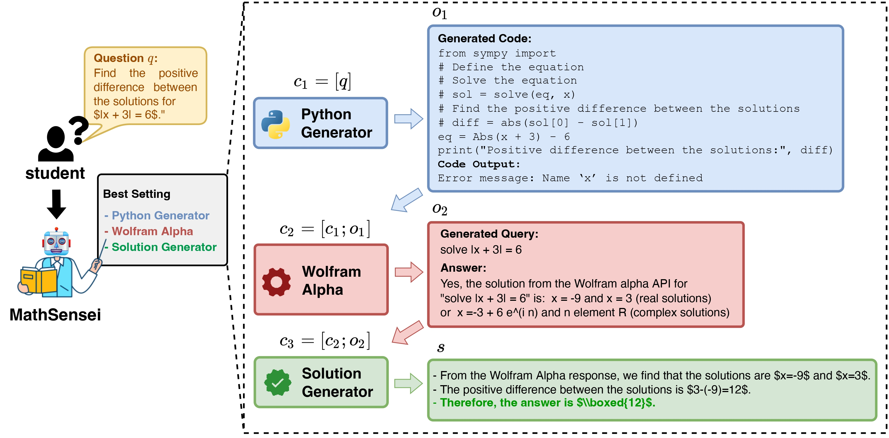

# MathSensei: A tool-augmented LLM for Math Reasoning

## Overview of End-to-End example from MATH dataset



## Run 
First, you will need to set the following keys at the start of ```model.py``` and ```utilities.py``` files:

### Set up Wolfram Alpha credentials
```os.environ["WOLFRAM_ALPHA_APPID"] = ""```

### Set up OpenAI credentials
```
OPENAI_API_KEY = ""
OPENAI_DEPLOYMENT_NAME = ""
OPENAI_API_VERSION = '' 
OPENAI_API_BASE = ""
MODEL_NAME = ""
```
### Set up Google API credentials (for Gemini)
```
GOOGLE_API_KEY = ""
genai.configure(api_key=GOOGLE_API_KEY)
```
### Set up huggingface token 
```huggingface_token = ""```

## Run the framework
Example, run the following command to start run on MATH dataset for the setting PG+WA+SG. You can also specify model of each module using options. See ```run.py```:
```
python run.py --dataset 'MATH' --model 'pg_walpha_sg' --label 'pg_walpha_sg_results' --debug  
````
## Datasets
The datasets used in this work are already included in the ```code/data``` folder.
- MATH: https://github.com/hendrycks/math/
- MMLU-MATH: https://github.com/hendrycks/test
- AQUA: https://github.com/google-deepmind/AQuA 
- GSM-8K: https://github.com/openai/grade-school-math

## Outputs 
The outputs from our paper are included in the ```code/outputs``` folder. We have outputs for four datasets namely, AQUA-RAT, MMLU-Math, GSM-8K and MATH. The prompts are in the ```code/demos``` folder.

## Planning results
Our preliminary results on planning are included in the ```code/planning``` folder. The prompts used for the REACT setup are in the ```code/REACT_prompts``` folder. Run the ```code/REACT.py``` file to get results of REACT on the MATH dataset.

## Citation 

```
@article{das2024mathsensei,
      title={MATHSENSEI: A Tool-Augmented Large Language Model for Mathematical Reasoning}, 
      author={Debrup Das and Debopriyo Banerjee and Somak Aditya and Ashish Kulkarni},
      year={2024},
      eprint={2402.17231},
      archivePrefix={arXiv},
      primaryClass={cs.CL}
}

```
